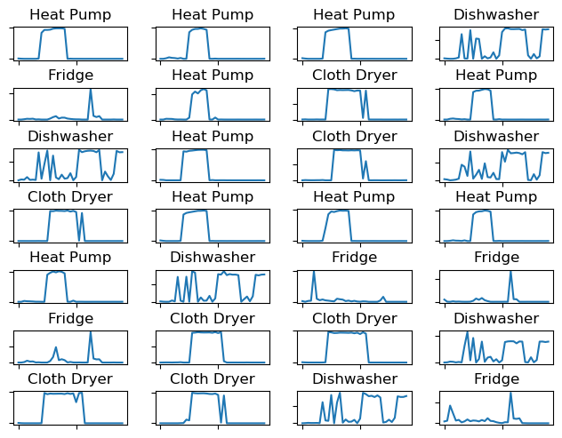
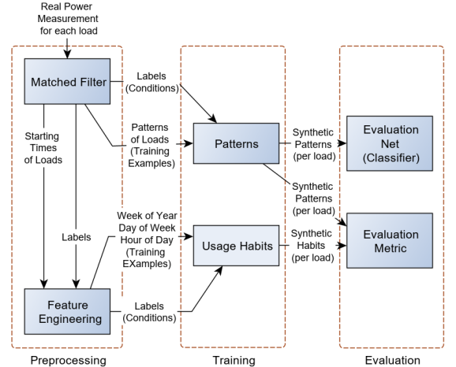
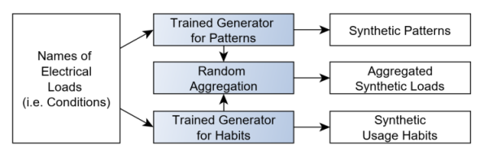

# Generating Patterns and Habits of Electrical Loads using Generative Adversarial Networks (GANs)

### Description

This code pertains to our paper:

https://ieeexplore.ieee.org/document/9136769

__S. El Kababji and P. Srikantha, "A Data-Driven Approach for Generating Synthetic Load Patterns and Usage Habits,"
in IEEE Transactions on Smart Grid, doi: 10.1109/TSG.2020.3007984.__

Please cite our above-referenced paper if you are using any part of our code.

We recommend reading the paper before using the code.

## Overview

Our software is intended to provide a flexible framework to generate *synthetic* electrical load patterns
and usage habits for individual loads in a household such as a dishwasher, cloth dryer..etc. The software may be
loosely referred to as load simulator or load profile generator. We use a *data-driven* approach using *Conditional
Generative Adversarial Networks (CGANs)* for generating load patterns. To generate usage habits, two alternatives are
proposed,namely: Kernel Density Estimator and Conditional Generative Adversarial Network.
The image below shows random samples of synthetic patterns generated by a *trained* CGAN for various loads.

In addition to load's patterns, usage habits of individual loads are generated. In other words, the distribution of
using an appliance (i.e. Hour of Day, Date of Week, Week of Year) is learnt using a generative models (KDE
and GAN in our case). Once learnt, usage habits may be simply sampled from the trained model.

The diagram below shows the proposed framework during the training phase.

Once trained, models can be used for inference to generate synthetic patterns and usage habits for individual
loads as shown below:

## Software Structure

The code is written using TF1.9 for research purposes, so there is great room for improvement.
Please refer to the list of requirements below for successful execution of the code.

The root folder includes four main folders:

1. code
2. raw_input
3. synth_output
4. training_runs

'code'
The first module of this project (CGAN-Patterns) allows users to train Generative Adversarial Networks (GANs)
to simulate various electrical loads. To train GANs, a user needs to input physical measurements of power values
of individual loads along with their time stamps. Typically, power measurements are provided with consistent
granularity (e.g. every 3 minutes). Unlike traditional electrical simulators that capture
loads' dynamics using hard-wired combination of components such as resistors, capacitors,
inductors..etc, GANs learn actual patterns of individual loads and resemble real-life
power consumption of individual loads. Once Trained, CGAN-Patterns stores the
trained model which can be used to generate synthetic power values for individual loads.

The second module of this project (CGAN-Habits) captures the consumers' habits to operate
individual electrical loads. For instance, a household may run a cloth dryer every Sunday.
Once trained, CGAN-Habits can be used to generate synthetic schedules of loads' usage
habits. As an alternative to CGAN, Kernel Density Estimator is provided to learn consumers'
behaviours.

Patterns (i.e. loads) may be randomly combined with their corresponding habits to
simulate a combination of electrical loads i.e. aggregate load profile of a house hold at smart meter level. Clearly, load profiles
of house holds may further aggregated in bottom-to-top approach to generate aggregate profiles at a bus level.

'raw_input' is where you upload your training dataset and their corresponding meta-data as per description given
below under 'Input Datasets'.

'traning_runs' is mainly used for training. Each training run is saved in separate subfolder. Henceforth, we will refer to
that subfolder folder as run_folder. The name of each run_folder carries a time stamp when the run was executed. The subolder also
contains a snaphot of the trained model. One of the important files in the run_folder is 'filtered_patterns.csv' which is
generated by the matched filter. This file is used for further processing, e.g. feature engineering for habits and
training CGAN-Patterns.

'synth_output' holds the synthetic data generated by our pre-trained model. The folder includes three subfolders:
'patterns' which includes the synthetic patterns in a form of csv file, namely 'synth_patterns_rounded.csv'.
The rest of plots are used for visual checking of generated samples.  The second folder is 'habits' which
includes the synthetic habits. The third folder is 'aggregate' which includes a random aggregation of both
patterns and habits. This is subject to further development. Typically, the 'aggregate' folder shall contain synthetic time
series power values pertaining to each selected load. Apparently, once we have per-load synthetic time-series of
power values, several loads may be easily combined by mere summation.

## Input Datasets

The model allows you to use several datasets for training. For instance, you may be interested to train the model
on both NA and European datasets. For that purpose, you need to provide meta-data pertaining to each dataset.
You can define your metadata in the file data.xml found in 'raw_input' folder.
You also need to upload to 'raw_input' folder your training datasets, i.e. time series of measured power values for loads of interest.
The said power file shall be of .csv type with headers showing the short names of
selected loads. The csv file and the short names of loads shall be all
referred to in the xml file. As indicated earlier, We have uploaded two datasets and defined their corresponding
meta-data in data.xml file.

Similar loads shall have same short names in all datasets. For instance, if a short name of Cloth Dryer is CDE in one dataset,
it should have the same name in all other available datasets

## Usage

<ol>
<li>Add all libraries as per requirements below preferably in new environment. </li>

<li>Clone repo. You should get the following subfolders:

<ul>
<li>code</li>
<li>raw_input</li>
<li>synth_output</li>
<li>training_runs</li>
</ul>

If you are missing any of the last three folders, please add it manually.`</li>`

<li>Go to url below and  extract zipped file to raw_input folder above:

https://drive.google.com/file/d/1BAxsCIk-Pn_ThmtgfISJ_v9xWlrFH3cr/view?usp=sharing

You should be able to see two .csv files that contain power measurements for various appliances. The two datasets differ
in the sampling rates. The third .xml file defines the metadata of both raw power measurements datasets. It is
recommended you open the data.xml file and make yourself familiar with corresponding datatsets,
e.g. appliances includes, sampling rates..etc.  The data in the link above is just an example built using datasets
from http://ampds.org/. Typically, you should upload your own data and define your data.xml accordingly.
Please refer to 'Input Datasets' above for further details. `</li>`

<li> Open the project in your IDE (e.g. VS Code)and go to CGAN_Patterns-> hyperparam.py and adjust your Hyper Parameters if needed. You can do the
 same thing for Habits by going to CGAN-Habits-> hyperparam.py.</li>

<li>Go to main.py. You have four options:
<ul>
<li>train CGAN-Patterns</li>
<li>Generate Patterns using pre-trained CGAN-Patterns</li>
<li>train CGAN-Habits</li>
<li>Generate Habits using pre-trained CGAN-Habits. This will also generate KDE-based Habits.</li>
</ul>

Choose one of the options above by simply commenting out the remaining three. Apparently, you will not be able
to generate patterns or habits unless you already trained some models.

*Note1:Please make sure to KILL all processes in IDE and clear all variables before you run any of the options above.*

*Note2: If you encounter an 'unable to find file 'error, please go to the files named 'paths.py'' under the folders CGAN_Patterns and CGAN_Habits and manually enter the correct paths.*

*Note3: When prompted to enter a folder, please enter folder name without the full path, e.g. P_RESP_2022391341. To keep track of experiments, the folders are time stamped.*

*Note4: If you want repetitive runs to result in different synthetic patterns and habits, you need to comment out random seed in train_patterns.*

</li>
</ol>

If you encounter difficulties or you would like to contribute in the development of the code, please email [Samer Kababji](mailto:skababji@gmail.com)

## Requirements

1. python==3.6.9
2. Tensorflow==1.9.0
3. keras==2.2.4
4. scipy===1.3.1
5. matplotlib==3.1.1
6. scikit-earn==0.21.3
7. pandas==0.25.0
8. seaborn==0.9.0

If you have anaconda installed, you may try to run: conda env create -f elecloadssim_v1.yml

*Note: Using other versions of Tensor flow do not lead to same results. Hyperparmaters need to be tuned for any other version.*
